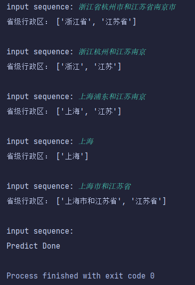

## NER by MRC 
仿照论文：A Unified MRC Framework for NER 中的思想，用MRC完成NER任务。
解码器使用双仿射变换构造成二维矩阵，使用global pointer解码实体的头尾。
效果还行，但感觉不如预期，没有很好的用上query信息。

另外，没有使用论文中的Start-End Matching，并且因为训练集全都是地址的形式，对于非地址类型的实体片段尾的预测效果不太好。
简单测试：

